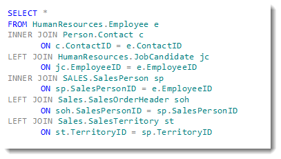

# Intro to Databases

---

# Basic Database Theory

* Basic Database Theory will be demonstrated in class.

---

# Joining 

* As you have seen, data in a database is [normalized](https://support.microsoft.com/en-us/help/283878/description-of-the-database-normalization-basics).    
   * When a database is *normalized*, it is structured in such a way that redundancy of data is minimized 
   * This allows a database to be faster, smaller, and more flexible when it comes time to change the data inside of it
   * Tables in a Database can be exported into `.csv` files that we can import into Pandas
* When a database is normalized, the data is contained within [tables](https://en.wikipedia.org/wiki/Table_(database)), related to each other by [keys](https://www.studytonight.com/dbms/database-key.php), or columns in one table that equal a column in another table, allowing them to be joined.
* We perform joining in a database with a language called SQL.

---

# SQL

* Traditional Databases work with a language called SQL (Structured Query Language)

* A SQL join statement looks like the above
* We can specify:
  * The tables to be joined to each other
  * _How_ the columns (keys) are related _to each other_ in the join
  * We can use this logic (referred to as relational algebra) to:
    * Filter out information
    * Make one-to-many or even many-to-many joins
* We'll be using Pandas, so our syntax will look different than above

---

# Join Types

* There are different types of Joins that are possible with database data; some of these will be demonstrated in the next class!

