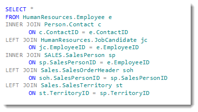

# Pandas Joining

## Learning Objectives

*After this lesson, you will be able to:*

* Concatenate objects with `.append()` and `.concat()`
* Combine objects with `.join()` and `.merge()`

<!--
* Combine timeseries objects with `.merge_ordered()`
-->

Traditionally, these operations are performed in a relational database with SQL (Structured Query Language).

With Pandas, you're able to perform the same operations in python! (The backend is `numpy`, a powerful linear algebra library.)

---

# To the Notebook!

We will commence this lesson directly in the Jupyter Notebook, `joining.ipynb`, to walkthrough the what, why, and how all at once.

Below, we have included a review of the key concepts.

---

# Why Join?

Pandas provides support for combining `Series`, `DataFrame` and even `xarray` (3 dimensional `DataFrame`s), with various kinds of set logic for the indices and relational algebra functionality in the case of join / merge-type operations.

More simply stated, joining allows you to combine `DataFrame`s.

* Joining is important because it allows us to:
   * reduce the _size_ of a database
   * _increase the speed_ at which data is queried and returned
   * _reduce the redundancy_ of the data stored in the database
* Joining is fundamental to proper data architecture, and we'll get to do it in Pandas!

## Why Use Pandas for Joining?

* It allows us to use 'python only' - avoiding integration with SQL
* This makes data analysis faster as we don't need to switch tools
   * Pandas run on a machine and thus is limited by that machine
   * Good for _prototyping_ and smaller, temporary jobs and analysis
* Longer term, code may be delegated to more specific tools (SQL, [Spark](https://en.wikipedia.org/wiki/Apache_Spark), etc.).
   * Pandas can't do everything
   * Industrial strength tools are designed to be distributed, have backup tools, etc

---

# What Does a SQL Join Look Like?



* A SQL join looks like the above
* We can specify:
   * The tables (dataframes) to be joined to each other
   * _How_ the columns (keys) are related _to each other_ in the join
   * We can use this logic (referred to as relational algebra) to:
      * Filter out information
      * Make one-to-many or even many-to-many joins
* We'll be using Pandas, so our syntax will look different than above

---

# What Does a Pandas Join Look Like?

```python
pd.merge(df1, df2,
         how='left', left_index=True, right_index=True,
         suffixes=('_df1', '_df2') )
```

| index | letter_df1 | number_df1 | letter_df2 | number_df2 |
| --- | --- | --- | --- | --- |
| 0 | a | 1 | e   | 5.0 |
| 1 | b | 2 | f   | 6.0 |
| 2 | c | 3 | NaN | NaN |
| 3 | d | 4 | NaN | NaN |

---

# Difference between SQL and Pandas

* SQL uses `JOIN`
   * Pandas has *two* semi-equivalent functions:
      * `.join` - used for joining dataframes _on their indices only_
      * `.merge` - used for joining dataframes _on any column you want_
   * Since `pd.merge` is more powerful and generalizes better, we'll focus on it
      * Joining operations creates dataframes that _mesh into_ each other
* SQL uses `UNION`
   * Pandas, again, has *two* semi-equivalent functions:
      * `.append` - stacks dataframes _on top of_ each other
      * `.concat` - stacks dataframes _on top of_ **or** _next to_ each other
   * Since `.concat` is more powerful and generalizes better, we'll focus on it
   * `.concat` and `.append` create dataframes that _stack_ on/next to each other
