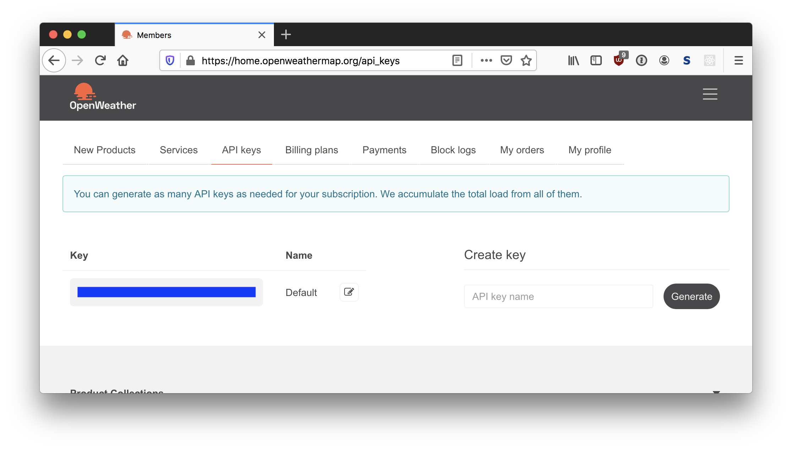

# Assignment: APIs

In this assignment, you'll practice:

* Including and using modules and packages
* Using data from APIs
* Reading documentation for modules and APIs

## Deliverables and Submitting

The usual!

---

# Exercise 1: Geo Cody

Cody and his friends Heather and Matt are going on a road trip across the Western United States and Canada. They want to visit several landmarks, national parks, and big cities.

Here's their agenda:

```
Space Needle
Crater Lake
Golden Gate Bridge
Yosemite National Park
Las Vegas, Nevada
Grand Canyon National Park
Aspen, Colorado
Mount Rushmore
Yellowstone National Park
Sandpoint, Idaho
Banff National Park
Capilano Suspension Bridge
```

Your job is to put these destinations into a list of strings called `destinations`.

Then, import the [geocoder](https://geocoder.readthedocs.io/providers/ArcGIS.html#geocoding) module, and use it to translate each of the landmarks into latitude-longitude coordinates. (This is an example of using an API through a **wrapper**.)

Now, loop through the list of locations, and print each location's latitude and longitude.

## Sample Code: `geocoder`

You'll need to install the `geocoder` module by running `pip install geocoder`.

We will be using `arcgis` service to translate the places to coordinates. The `geocoder` module is a **wrapper** that wraps the `arcgis` service (among others) so you don't have to do it manually via HTTP requests.

Visit the [docs](https://geocoder.readthedocs.io) for more sample code.

```python
import geocoder
location = geocoder.arcgis('Redlands, CA')
print(location.latlng) # latlng is a list with a length of 2
```

**Hint:** This follows the pattern in the `geonames` example in the [docs](https://geocoder.readthedocs.io/results.html). The only difference is using the `arcgis` provider instead of the `geonames` provider.

## Sample Code: Decimal Places Display

If you'd like to truncate the display of floating point numbers, you can specify exactly how many digits you want after the period using `f`-strings:

```python
my_float = 1.23456789
print(f'{my_float}')     #--> 1.23456789
print(f'{my_float:.2f}') #--> 1.23 (2 decimal places)
print(f'{my_float:.4f}') #--> 1.2345 (4 decimal places)
```

## Starter Code

Some starter code is already in the file `exercise1.py`. Continue your implementation there.

## Expected Output

```
Space Needle is located at (47.6205, -122.3493)
Crater Lake is located at (42.8684, -122.1685)
Golden Gate Bridge is located at (37.8199, -122.4783)
Yosemite National Park is located at (37.8651, -119.5383)
Las Vegas, Nevada is located at (36.1699, -115.1398)
Grand Canyon National Park is located at (36.1070, -112.1130)
Aspen, Colorado is located at (39.1911, -106.8175)
Mount Rushmore is located at (43.8791, -103.4591)
Yellowstone National Park is located at (44.4280, -110.5885)
Sandpoint, Idaho is located at (48.2766, -116.5535)
Banff National Park is located at (51.4968, -115.9281)
Capilano Suspension Bridge is located at (49.3429, -123.1149)
```

---

# Exercise 2: Heather Weather

Cody is satisfied by geolocating his landmarks, but Heather wants to take it one step further and get the current weather at each location.

Help Heather with some code that calls an API to get current weather based on latitude-longitude coordinates. Use the [Open Weather Map API](https://home.openweathermap.org/users/sign_up) for this.

**Note:** You will need to register for an account to get an API key, but it is free to use (up to 60 calls per minute).

## API Key

When you first log in to the Open Weather Map API site, you will need to generate an API key.

* Click the "API Keys" tab and "Generate" to generate an API Key.



This is your personal API key, which you'll need to make calls to the API.

## Current Weather

Now, try out the [**current weather data**](https://openweathermap.org/current) functionality of Open Weather.

There are several ways to get the current weather of a place, but we'll be looking up the weather by **longitude and latitude**, since we already got that information in Exercise 1.

For example, if you enter the following URL in your web browser:

```
https://api.openweathermap.org/data/2.5/weather?units=imperial&appid=API_KEY&lat=35.02&lon=139.01
```

Note the 4 parts of the querystring in the URL:

   * `units=imperial` (asking for temperature in fahrenheit)
   * `appid=API_KEY` (be sure to replace API_KEY with **your own** API key!)
   * `lat=35.02`
   * `lon=139.01`

The result you get back from the API is some data representing the weather in **Tawarano, Japan**, which is at at a latitude of 35.02. and longitude of 139.01.

```
{"coord":{"lon":139.01,"lat":35.02},"weather":[{"id":801,"main":"Clouds","description":"few clouds","icon":"02n"}],"base":"stations","main":{"temp":72,"feels_like":78.84,"temp_min":72,"temp_max":72,"pressure":1012,"humidity":92},"visibility":10000,"wind":{"speed":1.01,"deg":184,"gust":3},"clouds":{"all":22},"dt":1596479605,"sys":{"type":3,"id":2019346,"country":"JP","sunrise":1596484530,"sunset":1596534274},"timezone":32400,"id":1861290,"name":"Itō","cod":200}
```

The data is in a format called `JSON`, which is basically a long string with a bunch of data. It looks like a huge mess of data and curly braces. That's OK, because your Python program won't care about how the data looks! (You can always install a [JSON prettify plug-in](https://chrome.google.com/webstore/detail/json-formatter/bcjindcccaagfpapjjmafapmmgkkhgoa?hl=en) into your browser if you want it to look nicer.)

The important idea here is that the data we are getting back from the API contains:

1. a key called `weather` with a list with only 1 element (the 0th element), which has a sub-key called `description`
1. another key called `main` which has a `temp` sub-key

Together these two pieces of information gives us a pretty good idea of how we should dress for the weather.

## Calling an API

Now, instead of calling the API in the browser, you'll have to call the API with Python using the [requests module](http://docs.python-requests.org/en/master/api/#module-requests).

We already installed the `requests` module in-class, so all you have to do to use it is to remember to `import requests` at the top of your program.

## Starter Code

Some starter code is already in the file `exercise2.py`.

Continue your implementation in `exercise2.py`.

You will have to copy over some of the code you have written from `exercise1.py` into `exercise2.py`.

**Hint:** In the API results, you'll need to access the `description` and the `temp` keys.
   * You can access `description` with: `result['weather'][0]['description']`
   * You can access `temp` with `result['main']['temp']`

### Expected Output

```
The Space Needle is located at (47.6205, -122.3492)
At The Space Needle right now, it's broken clouds with a temperature of 72.75
Crater Lake is located at (42.9116, -122.1483)
At Crater Lake right now, it's clear sky with a temperature of 69.37
The Golden Gate Bridge is located at (37.8191, -122.4785)
At The Golden Gate Bridge right now, it's clear sky with a temperature of 68.47
Yosemite National Park is located at (37.7490, -119.5885)
At Yosemite National Park right now, it's clear sky with a temperature of 85.66
Las Vegas, Nevada is located at (36.1719, -115.1400)
At Las Vegas, Nevada right now, it's clear sky with a temperature of 101.08
Grand Canyon National Park is located at (36.0573, -112.1096)
At Grand Canyon National Park right now, it's clear sky with a temperature of 86
Aspen, Colorado is located at (39.1900, -106.8182)
At Aspen, Colorado right now, it's clear sky with a temperature of 84.96
Mount Rushmore is located at (43.8803, -103.4588)
At Mount Rushmore right now, it's clear sky with a temperature of 77.04
Yellowstone National Park is located at (44.9775, -110.6983)
At Yellowstone National Park right now, it's clear sky with a temperature of 77.63
Sandpoint, Idaho is located at (48.2730, -116.5478)
At Sandpoint, Idaho right now, it's clear sky with a temperature of 78.28
Banff National Park is located at (51.1780, -115.5703)
At Banff National Park right now, it's broken clouds with a temperature of 75
Capilano Suspension Bridge is located at (49.3430, -123.1139)
At Capilano Suspension Bridge right now, it's scattered clouds with a temperature of 74.8
```

## Remove Your Key!

When you are done with Exercise 2, **remove your key from your source code file** before committing and pushing your code to Github!

---

# (STRETCH) Exercise 3: Format for Matt

**Note:** Exercise 3 is a stretch goal for those who just can't get enough. It's not difficult, so you should do it if you have the time to do so. Simply continue the implementation in `exercise2.py` if you choose to do the Bonus Exercise!

Matt likes Heather's idea of getting the weather for each location they plan on visiting, but he thinks the data is unreadable.

Modify your code to:

1. Display a newline after each location (`\n`)
1. Display only one decimal place on the temperature (think about string formatting)
1. Display an F (for Fahrenheit)
1. Display a unicode degree (&deg;) character
   * You're gonna have to research a bit to figure out how to print out a Unicode character!
   * Here's some additional resources:
      * [List of Unicode Characters](https://en.wikipedia.org/wiki/List_of_Unicode_characters)
      * [Obscure Unicode Characters](http://jrgraphix.net/r/Unicode)
   * **Hint:** The degree (&deg;) character has a Unicode Code of 00B0

### Expected Output

```
The Space Needle is located at (47.6205, -122.3492)
At The Space Needle right now, it's broken clouds with a temperature of 72.8°F

Crater Lake is located at (42.9116, -122.1483)
At Crater Lake right now, it's clear sky with a temperature of 69.4°F

The Golden Gate Bridge is located at (37.8191, -122.4785)
At The Golden Gate Bridge right now, it's clear sky with a temperature of 68.4°F

Yosemite National Park is located at (37.7490, -119.5885)
At Yosemite National Park right now, it's clear sky with a temperature of 85.7°F

Las Vegas, Nevada is located at (36.1719, -115.1400)
At Las Vegas, Nevada right now, it's clear sky with a temperature of 100.9°F

Grand Canyon National Park is located at (36.0573, -112.1096)
At Grand Canyon National Park right now, it's clear sky with a temperature of 86.0°F

Aspen, Colorado is located at (39.1900, -106.8182)
At Aspen, Colorado right now, it's clear sky with a temperature of 85.0°F

Mount Rushmore is located at (43.8803, -103.4588)
At Mount Rushmore right now, it's clear sky with a temperature of 77.0°F

Yellowstone National Park is located at (44.9775, -110.6983)
At Yellowstone National Park right now, it's clear sky with a temperature of 77.6°F

Sandpoint, Idaho is located at (48.2730, -116.5478)
At Sandpoint, Idaho right now, it's clear sky with a temperature of 78.3°F

Banff National Park is located at (51.1780, -115.5703)
At Banff National Park right now, it's broken clouds with a temperature of 75.0°F

Capilano Suspension Bridge is located at (49.3430, -123.1139)
At Capilano Suspension Bridge right now, it's scattered clouds with a temperature of 74.8°F
```

---

# Done and Done!

Too bad we don't have time for an actual road trip...


